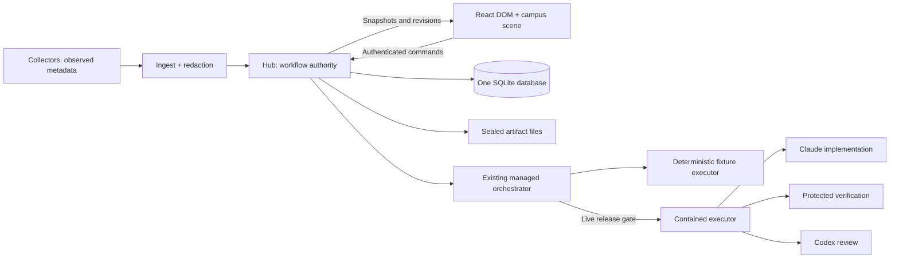

# Agent City — engineering workspace design

Date: 2026-10-02, Australia/Sydney. Status: **DESIGN FOR EDWARD'S APPROVAL; APPLICATION CHANGES NOT STARTED**.

## Main recommendation

Build a repository workspace around **persistent proposals, two server-enforced human approval gates, and the existing managed pipeline**. Keep Bun, Hono, SQLite, shared TypeScript/Zod contracts, React, and Three.js. The campus is a navigable view of that workspace; the hub owns authority. A CEO is a presentation role that summarizes recorded work and carries an approval document, with no extra model or execution permission.

Use the managed branch at `f960055` as the implementation starting point after revalidation. It contains the current telemetry baseline as an ancestor and substantial reusable execution/evidence code. Add a thin, stable workflow task above its existing bounded pipeline task instead of rewriting the orchestrator. Start with a **persistent, simulated end-to-end workspace**, then build the mature business campus, then establish containment and verify real providers. Real execution is a separate release gate. Neither this design nor accepting a task result authorizes merge, push, deployment, or GitHub writes.

No new planner service, meeting service, queue service, database, or routine CEO model calls are needed. Reusable planning forms and deterministic summaries cover the immediate product. The only proposed additional runtime boundary is an isolated executor for live work, justified by the existing lack of OS containment.

## A. Verified current state and uncertainties

### Environment and preservation

Actual working directory: `/Users/edwardhwang/Desktop/github-repo-only/agent-city`.

| Accessible source | Branch / HEAD | Initial working state |
| --- | --- | --- |
| `/Users/edwardhwang/Desktop/github-repo-only/agent-city` | `phase1/event-normalization` / `429a08bd14f0c1b77b06be42acdfc3bb0e1b952e` | Clean; no staged or unstaged changes; no nonignored untracked files |
| `/Users/edwardhwang/Desktop/github-repo-only/agent-city-v011` | `hardening/managed-v0.1.1` / `f960055448e4f5a0bd93a7b9ca0aeb0d2ef8597d` | Clean; no staged or unstaged changes; no nonignored untracked files |
| `/Users/edwardhwang/Desktop/github-repo-only/agent-city-ui-prototype` | Standalone directory; no Git metadata, branch, or HEAD | Source, tests, documentation, and saved screenshots accessible; Git dirty/untracked classifications unavailable |

`git merge-base 429a08b f960055` returned `429a08b`. The managed checkout is a registered sibling worktree. No checkout, merge, reset, stash, cleanup, install, service launch, provider invocation, credential change, commit, push, or deployment occurred. No `.env` contents, provider session stores, real managed configuration, or real database were inspected. Applicable `AGENTS.md` files were read in all three locations; no ancestor `AGENTS.md` was found along the inspected parent chain.

A SHA-256 preservation snapshot of 208 existing source/document/configuration files showed zero changes after inspection and probes. This new document is the sole intended repository addition. Recheck HEAD/status at implementation kickoff because backend work may continue independently.

### Capability inventory

| Area | What exists in source | Evidence level and product gap |
| --- | --- | --- |
| Collector | Claude launcher watchdog, bounded stdin, zod-free mapping, redaction, spool-before-send; Codex tail offsets committed after delivery/spooling | Implemented; process/transport regressions exist. Collector runtime, installed hooks, current machines, and delivery durability were not exercised here. Telemetry is observational, not task execution authority. [S1][S2] |
| Observed sessions | Machines/repos/paths/sessions/agents/events; event deduplication, session revisions, stale sweep, repo remap invalidations | Implemented. `Event.type` remains a free string and session state follows hook types; the branch name and normalization roadmap do not establish a separate normalized run/health subsystem. [S3][S4] |
| Hub / persistence / transport | Hono, SQLite WAL and additive migrations, ingest bearer authentication, Host/Origin guards, read APIs and WebSocket broadcasts | Implemented. Observed `/api` and `/ws` are unauthenticated on loopback. Managed content requires a token, but managed task IDs are currently broadcast on the public socket. No replayable private event stream exists. [S5][S6] |
| Managed pipeline | Explicit submission, frozen base SHA/policy hash, idempotent Run, one worker, leases/fencing, local worktrees, implementation → verification → review → bounded repair | Implemented on v011. Its Run action itself records approval; there is no typed-name decision record or two-gate authorization system. [S7][S8] |
| Evidence / reviews | Candidate commit, bounded redacted artifacts, evidence manifest, strict review output bound to candidate/manifest, one verified read for delivery | Implemented, with the five corrective changes below. Hashes prove byte consistency under the control plane's trust boundary, not completeness or truth of verification. [S9][S10] |
| Result acceptance | Pipeline ends at `human_ready` with an approving model review | Persistent human acceptance, result rejection/change request, and HQ inbox are missing in backend contracts/routes. `human_ready` is currently terminal for that pipeline task. [S7][S11] |
| Managed React UI | Token-based task forms, task detail, artifacts, diagnostics, deep links, polling, request sequencing/auth epochs, simulated/live labels | Implemented conventional UI. The bearer token is kept in `sessionStorage`. It has Run/Cancel rather than HQ decisions. [S12] |
| Separate mock UI | In-memory store, both typed-name gates, binding invalidation, task/meeting fixtures, cutaway Three.js scene, keyboard/reduced-motion/fallback paths | Implemented as a disposable UI fixture with no hub connection. Its proposal versions, meetings, evidence status, and acceptance are UI-only. Its reducer is not backend authority. [S13][S14] |
| Visual direction | Circular island, pastel buildings, domed HQ, large introductory text, narrow 400px task panel | Verified in source and a saved 1280 screenshot. Retain navigation/interaction lessons; replace the art direction and information allocation. Saved browser results are historical, not a fresh layout check. [S15] |
| Tests / CI | Managed schema, process, pipeline, API, recovery, corrective and browser tests; read-only hosted CI workflow | Tests exist. Verification documents report earlier green full suites and browser gates. Hosted CI is explicitly recorded as not run; live integration remains `false`. No full-suite or CI claim is made by this inspection. [S16] |

### Present status of the five reported managed defects

Here **direct probe** means a function/service call using synthetic data, temporary files, and an in-memory DB. It does not mean an HTTP server, whole managed pipeline, actual provider, or production reproduction.

| Reported defect | Current source / regression | Current assessment |
| --- | --- | --- |
| FIFO evidence/scratch reads block hub | `SAFE_READ_FLAGS` includes `O_NOFOLLOW` and `O_NONBLOCK`; descriptor `fstat` requires a regular file; scratch reader uses the same flags. Corrective C4 has isolated FIFO and hub-responsiveness cases. [S9][S17] | Corrective code present. Fresh direct probes rejected both artifact and scratch FIFOs within an externally bounded Bun process. Whole-hub liveness tests were not run. |
| Diff prefixes bypass multiline redaction | `redactDiff` reconstructs visible old/new versions without diff prefixes, masks them separately, and maps back. C3 tests cover stored diff/reviewer/API surfaces and divergent context. [S9][S17] | Corrective code present. Fresh synthetic diff with a visible secret header was masked. End-to-end C3 cases were not rerun. A context omission limitation remains, below. |
| Quarantined preflight child permits later launch | `settled`/`cleanExit` reject unresolved children; common `ctx.run` boundary checks quarantine/claim; implement/review stop after unconfirmed preflight. C1 tests cover both providers' version/help/auth and an adapter ignoring results. [S8][S17] | Corrective code present. Fresh predicates reject exit 0 with an unresolved child. Later-launch suppression is static evidence plus existing regression source, not freshly reproduced with child processes. |
| Protocol overflow discards failure and permits success | `protocolLoss` rejects oversized/dropped or malformed JSONL records; both adapters consult it before accepting output. C2 includes oversized failure followed by success and capture-only truncation controls. [S17][S18] | Corrective code present. Fresh helper probes fail closed on line loss/malformed records and accept the clean control. Oversized actual streams were not generated in this pass. |
| Artifact delivery omits reviewed-manifest binding | `readTaskArtifact` verifies the run's evidence unit, every review's candidate/manifest binding, and serves the already verified buffer. C5 tests cover coherent row/file and manifest/run rewrites. [S10][S17] | Fresh service probes: untampered control returned original text; file+row tampering and manifest+run tampering both raised `409 artifact_integrity`. HTTP route delivery was not exercised. |

**Remaining important limitations:**

- Fresh synthetic reproduction: a YAML block body can survive `redactDiff` if its secret-named header lies outside the diff hunk. Removing prefixes cannot reconstruct omitted source context. This establishes a direct redactor limitation, not a newly reproduced production leak. Live evidence preparation must inspect complete old/new file context or fail closed when safe disclosure cannot be established.
- Quarantine recovery loses its held-pipe observation after hub restart and stays closed to execution indefinitely. `claimNext` blocks all managed tasks while any quarantine is open. Also, pipe EOF alone proves closure of those descriptors, not termination of every escaped process; that is an architectural limitation of the current proof mechanism. [S8]
- Worktrees, process groups, post-run scope checks and filtered environment are not OS containment. The worker shares the hub user's host access; its allowed environment includes `HOME`. Installed CLI controls/authentication/billing behavior were not checked. [S19]
- Trusted argv does not make a candidate-controlled script trustworthy: `/bin/sh verify.sh` can execute changed repository content. Live required checks need a protected harness and toolchain, alongside separately labelled candidate tests.
- No explicit cost reservation, cumulative execution budget, CPU/memory quota, isolated review filesystem, or durable supervisor job identity is established by the current managed contracts. Timeout/output bounds and repair counts are useful but narrower guarantees.

### Fresh validation performed

Existing Bun 1.4.2; cleared environment, disposable HOME/TMPDIR/AGENTCITY_HOME, `--no-env-file`; no dependency installation.

| Check | Result |
| --- | --- |
| v011 `managed.test.ts`, `managed-view.test.ts`, `merge.test.ts` | **36 pass, 0 fail, 187 assertions** |
| Prototype `tests/store.test.ts` | **22 pass, 0 fail, 133 assertions** |
| Independent direct corrective probes | **7 checks passed**; context omission limitation observed separately |
| Full backend/process/browser suites, provider preflight, live calls, OS containment, hosted CI | **NOT RUN** |

Probe source, logs and preservation records: `/private/tmp/agent-city-design-k_df3nwm/`. Saved UI screenshot inspected: prototype `e2e/screenshots/building-1280.png`; historical browser record timestamp: `2026-10-01T10:50:58.035Z`. Neither is presented as a new browser run.

## B. Recommended architecture and responsibilities

The diagram's contained executor is proposed. Current v011 execution runs in the hub's OS context.

| Component | Responsibility and authority |
| --- | --- |
| Hub | Validates operator commands, publishes immutable proposal snapshots, decides approvals/invalidation, owns all business-state writes, leases, reservations, evidence registration and acceptance. Sole SQLite writer. |
| SQLite | Authoritative records for observed metadata and separately namespaced managed workflow. A queued row is the queue; short transactions handle claims/decisions. No Redis/message broker/event-sourcing rewrite. |
| Orchestrator | Drives deterministic transitions using an approved snapshot. Model outputs propose changes/verdicts; this code decides legality, state and downstream work. Keep existing fencing/reconciliation logic and strengthen its boundaries. |
| Executor | Runs only hub-authorized, policy-selected stages. Simulated mode retains the fake adapters. Before live, a fixed local helper executes inside one isolated worker VM with job supervision; it receives no DB or approval authority. |
| Artifact store | Operator-owned directory, outside writable model workspaces. Immutable sealed input evidence and result envelopes; ID-based reads verify bytes and binding once, then use that buffer. |
| React | One normalized cache of server snapshots plus local selection/form state. Sends intentions and waits for authoritative responses. Presents authorization, progress, blockers, evidence and decisions. |
| Three.js | Camera, campus, offices, role representations and optional movement. Consumes selectors and emits selection events only. No approval, stage progression, task scheduling or timers that mutate business state. |
| Collector / observed view | Existing redacted activity monitor. Cannot queue, complete, accept, cancel or supervise a managed task. Link an observed session only by an explicit recorded provider session reference, never by timing/proximity alone. |

**Topology default:** keep hub/UI local on the MacBook for the first milestone; retain existing collector transport. Defer spine hosting, phone access, Relay, Funnel and new remote scheduling. Before live execution, use one isolated worker VM on an explicitly configured host, with a dedicated clone and no personal host mounts. The UI location does not determine execution location. A dedicated user/clone without enforced filesystem, network and descendant containment is insufficient for the live release gate.

The executor's narrow IPC contract is `stage_execution_id`, `execution_id`, `run_id`, `fence_token`, proposal/policy hashes, stage, approved workspace identity, fixed command-profile ID, deadline and resource reservation. The helper resolves profiles from trusted host configuration; the UI/model supplies no shell or argv. Responses include the same IDs/fence, supervisor job/boot identity, bounded structured events, outcome and termination evidence. Hub rejects stale results. A worker restart never causes an uncertain model launch to be repeated.

## C. Core contracts and lifecycle

### Entity model

Use snake_case, UTC timestamps, Zod at boundaries and explicit contract versions. Preserve current session/agent/event IDs and observed status machine.

| Entity | Contract / storage recommendation |
| --- | --- |
| Repository | Existing `repos` supplies read-only GitHub metadata and district; trusted config supplies managed eligibility, canonical dedicated clone/host, base ref, protected paths and verification profiles. Discovery never grants execution. `client` stays monitor-only by default. |
| Workflow task | New thin `workspace_tasks`: stable `id`, `repo_id`, `current_proposal_id`, optional accepted decision pointer, timestamps and `rev`. User selection/history belong here. Execution badges derive from linked records, not another mutable status machine. |
| Proposal | New immutable `managed_proposals`: task ID, monotonic version, canonical specification, content/context/policy hashes, base and optional seed SHA, provenance and creation metadata. Edits create a new version. Contract `agentcity.proposal/v1`. |
| Execution request | Retain existing `managed_tasks` as one bounded pipeline execution of a frozen proposal. Add workflow/proposal/decision references. A fresh human rerun/change creates another execution record; old terminal rows and attempts stay intact. This avoids changing old terminal states into editable drafts. |
| Attempt | Existing `managed_runs`: one initial/repair attempt, exact parent/base/candidate, provider metadata, outcome and evidence hash. Add proposal/authorization references. UI shows execution and attempt identity; it must not conflate attempt 1 of two separate executions. |
| Agent assignment | A stage's role/provider/requested and resolved model/session reference. Derive employees from stage records, with unknown values shown as unknown. CEO is repository presentation metadata. No extra persistent model session is created for it. |
| Stage execution | Before live, add durable per-invocation records: stage ID, launch intent, job/host boot identity, claim/fence, timestamps, deadline, usage/reservation, outcome and termination proof. Needed because a run row's latest PID cannot fully audit every preflight/check/model invocation. |
| Artifact | Existing rows/files retained; sealed bytes, kind, byte length, SHA-256, task/execution/run identity and truncation state. Raw host paths are not web API inputs. |
| Review | Existing exact candidate + input-manifest binding retained; structured findings and strict output, no claimed test execution. Hash the canonical review row/output in the final result envelope as well. |
| Approval request | New `managed_approval_requests`: task/proposal/execution, gate, immutable binding snapshot/hash, pending/approved/accepted/changes_requested/rejected/invalidated status, revision, timestamps and invalidation reason. Unique pending request per gate and subject binding. |
| Human decision | New append-only `managed_decisions`: request, actor, gate/action, exact binding, `confirmation_text`, decision/idempotency ID and timestamp. Only approve/accept require fresh exact `Edward`. Original decisions remain visible after request invalidation. Contract `agentcity.approval/v1`. |
| Meeting | Later SQLite meeting document plus action rows: topic, participant repo IDs/roles, referenced proposal/result hashes, issues, decisions, open questions and one-repo action proposals. Unique action→draft linkage makes conversion idempotent. |

The four new workflow tables above are the first milestone's minimum persistence addition. Existing pipeline rows, artifacts and schemas remain reusable underneath. Add migration `008_workspace_approvals.sql` if still next at kickoff; never edit applied `006`/`007`. Read legacy v1 rows as history. Do not manufacture typed approvals, acceptance or actor identity for them.

### Exact proposal specification

The proposal contains title/objective; acceptance criteria with stable IDs; allowed and protected path scope; verification profile IDs and a criterion→check/evidence mapping; base SHA and optional repair seed SHA; controlled context references/hashes; Claude implementer and Codex reviewer profiles/models; mode; risks; resource/billing policy; explicit repair policy; and trusted policy/toolchain/prompt-template versions.

Planning starts with saved task templates and user intent. Required fields and repo check profiles are supplied by a deterministic composer. User-authored managed task text is retained only under the managed-task exception; observed prompts remain length-only. Show the exact sanitized proposal before submission for approval. If sanitization changes text, the displayed snapshot is what is approved; no raw secret copy is stored. Summaries cannot replace the exact specification.

`proposal_hash = sha256(canonical_json(specification))`.

`execution_binding = sha256(canonical_json({proposal_id, proposal_hash, execution_request_id, base_sha, seed_sha, context_hash, policy_hash}))`.

The policy hash covers scope/deny rules, repo and host identity, provider settings/capability profile, verification/harness versions, output roots, limits, billing policy and repair allowance. Repo rules and relevant context are captured in the controlled snapshot; do not silently read changed rules after approval. A base branch advancing does not mutate a pinned proposal; choosing the newer base creates a new proposal/version and approval.

### Gate 1 — authorize execution

1. A draft becomes a versioned proposal and a pending HQ request bound to one reserved execution request. Submission starts no implementation, verification or review stage. Trusted read-only Git/context inspection may resolve the exact input before approval.
2. HQ shows objective, criteria, exact scope/base, check plan, providers, allowed repair, limits and risks. All are available without watching a CEO animation.
3. Edward types `Edward` into an initially empty, request-local field, then activates **Approve execution**. Enter in the text field does not approve. No batch approval, prefill, signature persistence or reuse between requests.
4. Server verifies operator authority, CSRF/challenge, exact confirmation, expected binding/revision and pending state. In one transaction it appends the decision, closes the request and queues exactly that frozen execution.
5. Claim and every stage launch recheck that decision's validity and hashes. The existing direct `/tasks/:id/run` cannot remain an approval bypass: remove its public queueing behavior or require the exact already recorded decision; it must never mint authority from a bearer token alone.

**Request changes** and **Reject** are separate explicit actions. They need authentication and a reason, but no name confirmation because they approve nothing. Gate-1 changes create a new proposal version for editing; rejection closes that proposal request. Neither queues work.

### Implementation, verification, review and repair

An approved execution follows the existing states:

`queued → executing → verifying → reviewing → human_ready`.

An eligible failure can create a repair attempt:

`verifying/reviewing → repairing → verifying → reviewing`.

The high-level UI phases are derived: Planning, Awaiting execution approval, Queued, Implementing, Verifying, Reviewing, Repairing, Awaiting acceptance, Accepted, Changes requested, Rejected, Blocked, Interrupted, Cancelled. Cancellation-pending and quarantine are independent visible conditions. Session `idle`/`ended`, process exit 0, a candidate commit and a model's “completed” text never establish task acceptance.

Keep trusted verification separate from Codex review. Required checks run against the exact candidate using protected, policy-selected harnesses/toolchains. Candidate-authored tests can supplement them, with their provenance visible. The reviewer receives a sealed candidate view, exact proposal and verified evidence; it cannot edit, run tests, approve execution or change criteria.

**Automatic repair boundary:** default repair count 0; Edward may explicitly approve **one** repair in Gate 1. This preauthorizes correcting actionable verification/review findings within the same goal, path scope, providers, check plan, original base and cumulative resource/call budget. Each repair creates a new attempt from the previous candidate, with fresh verification, evidence and independent review. It does not reuse an earlier result approval. Review prose is untrusted data, never executable commands.

| Trigger | Authorization consequence |
| --- | --- |
| Ordinary actionable check/review defect within approved scope; one repair explicitly allowed and unused | Continue under the original execution decision; record findings hash/parent candidate/new attempt and remaining budget. |
| New human-requested behavior, including Request changes at Gate 2 | Create a new proposal (with chosen seed candidate if appropriate) and a fresh Gate-1 request. Even a small change needs renewed approval. |
| Changed scope/criteria/base/context/checks/models/host/policy/limits; repair exhausted; finding requires broader scope | Invalidate affected execution approval, stop further launches, and request a new proposal/approval. |
| Evidence corruption, candidate mutation, scope violation, malformed review/protocol, unknown process termination, auth/quota/environment error | Stop/blocked/interrupted as appropriate. These do not qualify for automatic repair. |
| Crash after model launch intent; human rerun of blocked/interrupted work | Preserve uncertain attempt; prove old execution stopped; create a fresh execution request with fresh Gate-1 approval. Never auto resume an uncertain model invocation. |

A deliberately planned repair does not invalidate Gate 1 merely because it produces a new candidate: Gate 1 binds the approved operation and original input, including that bounded repair allowance. Gate 2 binds one exact output. Unplanned candidate/evidence changes invalidate Gate 2 and any candidate-dependent new execution proposal.

### Gate 2 — accept an exact result

After passing required verification and a valid approving review with no blocker/major finding, create a pending result request. `human_ready` means **awaiting Edward**, not accepted.

Create `agentcity.result/v1`, an immutable result envelope containing workflow/proposal/execution/attempt IDs, execution decision ID, base/parent/candidate/tree SHAs, input-manifest hash, complete required artifact identity/hash/length list, review ID/canonical hash, verification results/criterion coverage, mode/provider provenance and policy hash. Hash this envelope and bind the Gate-2 request to it. The input manifest excludes the review produced afterward; the result envelope binds both without a circular hash.

Before accepting, server revalidates exact candidate, all required evidence bytes, current review, no outstanding blockers/cancellation/quarantine, proposal relevance and request revision. Protected immutable storage plus a short final CAS transaction closes the check/commit gap; do not hold a SQLite transaction across slow subprocess reads. Any version change during validation rejects the action with `409 stale_binding` and invalidates the request. Integrity failures cannot be overridden by typing a name.

Edward freshly types `Edward`, then clicks **Accept result**. Persist acceptance of that envelope and nothing else. Gate-2 Request changes creates a linked draft and new Gate-1 request after editing; Reject records rejection with no repair or new execution. Acceptance does not merge into the source checkout or authorize another repository. Later evidence corruption/candidate mutation invalidates the currently valid acceptance and raises a visible alert while preserving its original historical decision.

### API command contracts

Keep routes in Hono under an authenticated `/api/workspace` namespace; the existing managed executor API becomes an internal compatibility boundary.

| API | Semantics |
| --- | --- |
| `GET /snapshot` and `GET /tasks/:id` | Capability/provenance labels, normalized records/revisions, pending requests, integrity and last confirmed state; no raw credentials/host secrets. |
| `POST /tasks` | Create a workflow task/draft; client-generated idempotency key. No execution. |
| `POST /tasks/:id/proposals` | Publish a new immutable sanitized specification; expected task revision + idempotency key. |
| `POST /proposals/:id/execution-requests` | Reserve one bounded pipeline execution and create Gate-1 request, never queue it. |
| `POST /approval-requests/:id/challenge` | Short-lived one-use challenge bound to operator session, request and binding hash. Clears on context change. |
| `POST /approval-requests/:id/decisions` | `{decision_id, idempotency_key, expected_request_rev, binding_hash, challenge, action, confirmation_text, reason}`; server validates gate/authority and commits exactly once. |
| `GET /decisions/:decision_id` | Resolve an uncertain response without approving twice. Same key/same payload returns original decision; a changed payload is a conflict. |
| `POST /executions/:id/cancel` | Persist authenticated intent; no new approval required to stop work. `cancelled` only after termination proof. |
| `GET /tasks/:id/artifacts/:artifact_id` | Check proposal/result relevance and verified byte/manifest/review binding. Plain text/JSON display, never executable HTML. |
| Later `POST /meetings/:id/actions/:action_id/draft` | Idempotent conversion into a one-repo draft. Cannot create a grant or queue work. |

Approval bodies cannot contain executable paths, shell text, provider keys or arbitrary model overrides. Reject unknown fields. All mutations have bounded bodies, authorization, expected revisions and idempotency. Lost responses display “Decision outcome unknown”; check the stored decision before retrying or asking for a new signature.

## D. User journeys and screen structure

### Daily journeys

1. **Assign:** select a building or searchable repo row → workspace opens immediately → Assign work → choose a saved template/describe objective → refine scope and criterion/check mapping → Submit proposal → HQ Gate 1 → type Edward and approve → execution appears in the same task panel.
2. **Monitor:** workspace shows current stage, attempt, provider, last confirmed update, checks, blockers, cancellation and remaining repair/budget. A passing review opens HQ Gate 2. The result panel shows exact candidate, evidence and findings; Edward accepts, requests changes or rejects.
3. **Repair:** eligible automatic repair appears as an explicit new attempt with its reason and remaining allowance. A human change creates a new proposal with predecessor links. Old rejected reviews/candidates remain readable.
4. **Interruption:** retain last confirmed state and evidence; explain whether termination is proven. Cancel stays pending if uncertain. Retry creates a new request after proof; no automatic restart of model stages.
5. **Inbox:** persistent HQ pending count; filter by repo/gate/blocked status, age and search. Open one request at a time; moving to another request clears the field. History shows actor, exact bound version, disposition and later invalidation.

### Layout and information hierarchy

English UI, compact 56px top bar and 56px navigation rail: City/Projects, Headquarters, Meetings, Activity. Primary buttons are **Assign work** and the current explicit decision/monitoring action. Remove introductory hero sections and decorative prose.

| Viewport | Main split after 16px padding and 16px gutter | Vertical allocation |
| --- | --- | --- |
| 1440×900 | 736px campus/workspace + 600px task/approval detail | 812px content height below top bar/padding |
| 1280×800 | 616px campus/workspace + 560px task/approval detail | 712px content height below top bar/padding |

Left pane: campus or selected cutaway above the current task list; HQ uses the lower left area for its approval inbox. Right pane: selected task or approval document. This preserves the spatial workspace beside the selected task without squeezing the decision document into two narrow columns.

Keep the right panel's identity/status header and action footer sticky. Always show repo/task, mode/provenance, execution/attempt, stage, acceptance status, connection freshness, and any pending cancellation/quarantine. Scroll objective/criteria/checks/findings/diff within the body. Long titles/paths/hash values wrap; accessible full identities and copy buttons remain available. No horizontal page overflow. Backend errors name the last confirmed state and a safe next action. Offline keeps the snapshot visibly stale and disables writes; reconnect revalidates bindings and clears confirmation.

### Campus specification

Replace the prototype's island with a compact office campus on a rectangular/irregular urban block: graphite framing, warm gray concrete, restrained wood, glass and muted green landscaping; one controlled blue accent for actionable state, amber/red for waiting/failure. Status also has text/icons. No giant mascot figures or pastel district walls.

One repo = one business building, grouped by district; metadata cannot silently add an executable repo. Stable layout keyed by repo ID, district pages/search for more than the visible group, no hardcoded four-repo ceiling. Building click/keyboard activation selects the workspace synchronously. Optional camera easing happens afterward.

Selected buildings reveal desks, readable monitor silhouettes, proportionate employees and a meeting room. Implementer works at a desk; verification appears at a check station; reviewer reads in a separate office. Empty desks reflect absence of recorded stages rather than invented staff. HQ has an office/decision desk. A CEO may carry a folder when a pending approval is recorded; that document is instantly available in the inbox. Hidden tab/reduced motion pauses ambient movement; motion never determines readiness.

Retain Three.js directly, lazy-loaded behind usable DOM controls. Cap device-pixel ratio, reuse geometry/materials, instance repeated office objects, render on demand when idle, and dispose resources. Use DOM repo buttons/labels rather than requiring canvas picking. If WebGL fails or loses context, use the same repo/task navigation in a DOM campus/list fallback. Do not block controls while a scene or projected label is rebuilding.

Keyboard: native buttons, logical tab order, visible focus, skip to task panel, Escape closes drawers/evidence, focus returns to the opener, and an optional command search. Approval buttons are `type="button"`; signature inputs never submit a form. Reduced-motion preference removes walks/camera travel. Screen-reader labels describe real role/state; visual employees are decorative. Full browser and manual MacBook checks at both requested sizes are exit tests, not results already obtained here.

### Fixture, simulation and live provenance

Three independent labels: **data source** (`UI fixture` vs `Hub record`), **execution mode** (`Simulated` vs `Live`), and **integration evidence** (verified host/provider profile vs unverified). Observed sessions also carry `Observed only`.

- UI fixture: synthetic hashes/check statuses, resettable memory, no backend execution; never display as a real verification pass.
- Hub simulation: real persistence, fixture Git operations, fake adapters and synthetic check/review semantics; zero real provider calls.
- Live: actual provider execution with the recorded host/CLI/model provenance. Unknown resolved model/usage/cost stays unknown. A simulation cannot establish live readiness.

Global mode is visible in the top bar and repeated on each task/approval/result. Production has no demo Advance/Confirm cancellation controls and cannot turn fixture history into real authority.

## E. Security, recovery and evidence guarantees

### Authorization and secrets

Treat the typed name as deliberate confirmation, not authentication or a legal signature. For the first milestone, use a single operator account `operator:edward`: manually supplied bootstrap credential exchanged for a short-lived, opaque **HttpOnly, SameSite=Strict** operator session. Keep the credential out of local/session storage and bundle code. Use Secure cookies when served over TLS; initial deployment remains loopback. Session expiry/logout/restart clears approval challenges and UI confirmation.

Every workspace mutation checks the operator role, exact configured app Origin, CSRF nonce and request binding. Read visibility is authenticated too. A worker/collector has no operator credential. Replace broad acceptance of all loopback origins for privileged mutations with the exact UI origin; development proxy origins must be explicitly configured. Credentialed clients can forge command bodies, so a typed-name field/challenge does not prove physical human typing. The security boundary is operator credentials and server permission checks; the UI supplies the required intentional interaction.

Retain separate ingest authorization. Use authenticated REST polling for managed workflow in the first milestone; leave the existing WebSocket for observed data and stop publishing managed IDs there. A private event channel can be added later inside Hono if polling proves inadequate. Do not widen the hub bind until read APIs/WebSocket and TLS/network authentication are addressed.

Provider credentials stay in the contained executor's dedicated credential environment, never the React UI, hub artifacts, verification processes or review text. Verification has no model credentials. Provider authentication/configuration setup is a separate operator action; no global `~/.claude`/`~/.codex` edits by agents. A no-model compatibility/auth check must positively prove supported controls before enabling a provider profile. Unsupported controls fail closed; never substitute guessed flags, bypass permissions or a fallback model.

Repository content, tool output, review findings and meeting notes are untrusted, including instructions embedded inside them. Secret-pattern logic remains shared; add complete-source-aware multiline evidence redaction without logging raw files. Exclude `.env`, private keys, credential stores, runtime DBs, and control-plane files from model mounts/read scope. `.env.example` may be allowed only as a blank template. Redaction is defence in depth: cannot guarantee recognition of every secret or encoded representation. If redaction removes evidence required to judge the task, mark it unavailable and block acceptance until safe evidence exists.

### Isolation, ownership, concurrency and limits

Initial policy: one active pipeline globally, one mutating stage/child at a time. Planning/drafts/inbox decisions can coexist. Global quarantine stops execution. Use approved relative path prefixes with segment boundaries, canonical path validation, symlink/escape denial and protected paths. Declared file ownership is stored in the proposal and enforced at the execution boundary and candidate check; post-run diff rejection alone cannot undo an unauthorized write.

Use a dedicated clone independent of the personal checkout/Git common directory. Each initial/repair attempt gets a fresh worktree or sealed candidate-derived workspace in that clone. Adapt current same-workspace repair to fresh attempts before live, preserving previous bytes and eliminating shared mutable review inputs. The control plane checkpoints local commits; providers do not commit. Source checkouts, user branches and unrelated work remain untouched. Every subprocess, including Git and preflight, uses the same supervised authority/deadline boundary.

Future concurrency is opt-in: per-repo execution lease, disjoint declared write scope where applicable, separate workspaces, and per-host capacity. Independent worktree changes do not imply safe integration; integrating competing candidates is a new explicit task. Cross-repo dependencies bind exact accepted contract/artifact versions. For the first release, serialize instead of implementing distributed locks or multi-worker scheduling.

Live runner defaults for small tasks: one active job, bounded implement/review/check deadlines, one optional repair, at most four implement/review invocations per grant, and a cumulative deadline/reservation. Example host resource profile: 2 vCPU / 4 GiB worker limit, configurable by trusted policy and shown before approval; these are proposed defaults, not verified host capacity. Enforce memory/CPU/disk/process-tree limits outside Bun and cap aggregate artifact/working-space storage. Stage timeout/log caps remain necessary but are not substitutes for those controls.

Default billing policy is subscription-only, no metered API fallback. Empty or unproved auth policy blocks live work. Record requested/resolved provider/model and reported usage per invocation; wall time, call count and repair allowance are enforced even when usage is absent. Show unknown currency cost rather than inferring zero. Do not offer a guaranteed monetary cap unless the provider exposes a verified enforceable limit/reservation; API-billed mode remains disabled otherwise. Unknown outcome consumes its reservation until reconciled. UI cannot raise limits beyond trusted host policy.

### Recovery and cancellation

| Condition | Required behavior |
| --- | --- |
| Crash before any provider launch intent | Reconcile reservation/workspace deterministically; bounded infrastructure retries only for documented idempotent operations under a still-valid approval. |
| Crash after model launch intent or lost worker | Fence first, stop the supervised job, mark attempt unknown/interrupted, retain bytes and reservations. Fresh human approval for a new execution; no automatic model relaunch. |
| Stale worker | Check fence/lease before launch and every result/state write; stale IPC results are discarded. Fencing protects records, not filesystem writes, so supervisor termination/contained workspaces are also mandatory. |
| Cancel vs finalization | Durable cancellation intent wins if recorded before final-state transaction. Stop all descendants, then record cancelled. Pending cancellation remains visible until proven. No result acceptance while pending. |
| Uncertain termination / inspection failure | Persist quarantine; block new claims/launches and acceptance. No dismiss/acknowledge override. PID start time mismatch prevents signalling unrelated processes. |
| Restart with held-pipe quarantine | Current code stays blocked. Before live, supervisor maintains durable job and boot identity; release only after objective job-empty evidence or proven destruction/reboot of the entire isolated worker environment. Hub/worker process restart and pipe EOF alone do not establish that proof. |
| Artifact disk full / partial file write | Atomic temp-file write + fsync + rename before DB registration; on restart unregistered orphan bytes are not evidence. Keep execution blocked if required bytes cannot be persisted. |
| Proposal/policy changes during active work | Invalidate affected grant, fence/stop launches and request cancellation of running work; retain evidence. New version requires Gate 1. Cosmetic scene/label changes do not affect authority. |

Backup/restore procedures use SQLite consistent backups and sealed artifact directories as a unit. Never continue a grant from a restored/stale execution lease. Retention preserves referenced approved/rejected attempts and decisions; cleanup is explicit and cannot delete evidence behind a current approval. This design pass did not test storage crash durability or backup recovery.

### Evidence acceptance conditions

Acceptance requires a complete manifest/result envelope, exact candidate/tree and proposal, all required checks completed with their pinned harness identities, valid review of the same input evidence, no blockers, and verified full stored bytes. Missing/truncated required diff or incomplete reviewer context blocks the result; bounded diagnostic excerpts may remain labelled truncated. Before live, record exactly what source/context was available to the reviewer rather than assuming it read files beyond the prompt cap.

Keep distinct: artifact byte integrity, candidate workspace integrity, coverage of acceptance criteria, check outcome, review verdict, and human decision. A hash is not proof that tests are meaningful; a model review is not an authorization grant. A privileged attacker who can rewrite the entire hub DB, artifact store and decisions is outside this local integrity mechanism's protection. No tamper-proof ledger or full host security claim is made.

## F. Keep, change and defer

| Decision | Reason / trade-off |
| --- | --- |
| Keep Bun/Hono/SQLite, schema package, collector IDs/redaction/spool and observed view | Already useful, consistent stack; avoid migrations/framework churn unrelated to product gaps. |
| Keep managed orchestration, fake adapters, fences, outcome classification, strict reviews and corrective tests | Substantial reusable behavior. Strengthen approval/containment/evidence boundaries instead of treating green tests as safety certification. |
| Add stable workflow task above bounded pipeline task | Supports proposal revisions and repeated human changes while preserving the old terminal execution/history model; costs four small workflow tables rather than an orchestrator rewrite. |
| Replace token-in-sessionStorage and Run-as-approval | Required authority cannot be enforced by a mock reducer or confirmation-only browser dialog. |
| Keep prototype HQ/keyboard/selection/fallback interaction patterns; replace store as authority | Reuse tested UX concepts; all real commands go through hub and shared contracts. |
| Replace island/hero/pastel palette and narrow panel | Confirmed experience calls for a business campus and readable engineering documents. Reuse rendering primitives selectively, not its scene layout or four-repo assumption. |
| Change evidence sealing, complete-file redaction and verification provenance before live | Direct probe exposed missing-context redaction; current trusted argv still invokes untrusted repo code. |
| Change process containment/restart proof before live | Current worktree/process-group mechanisms permit host access and unrecoverable quarantine. A supervised isolated executor adds justified complexity. |
| Defer automatic planner, CEO sessions and multi-agent meetings | Templates/manual documents solve planning first without recurring cost or more authority surfaces. Optional future read-only consultation uses the same bounded execution/approval machinery. |
| Defer remote hub/Relay/phone/GitHub write actions and multiple workers | Not needed for the first useful workspace; adds exposure, recovery and integration complexity. |

## G. Staged implementation plan

The architect remains in this session. File-area ownership below defines implementation boundaries and integration order, not a request to delegate work or hand off to another model. Each stage finishes with independent checks of actual behavior and updated verification records.

| Stage / dependency | Owned file areas | Deliverable and exit criteria |
| --- | --- | --- |
| 0. Baseline, after design approval | Implementation branch/worktree metadata; design/checkpoint docs | Revalidate v011 HEAD/status, preserve parallel work, create/reuse one clean implementation checkout based on its reviewed descendant. Confirm policy and legacy data handling. No merge of existing worktrees as an implicit starting action. |
| 1A. Contracts and persistence; depends 0 | `packages/schema/src/workspace*.ts`, new migration; `apps/hub/src/managed/store.ts` compatibility; new workflow store | Immutable proposals, stable tasks, two approval request types, append-only decisions and exact bindings. Temp-DB migration tests; same-key duplicate requests/decisions exactly once; old rows remain read-only history with no invented signatures. |
| 1B. Authority boundary; depends 1A | `apps/hub/src/routes/workspace.ts`, workflow service/auth; `managed/service.ts`, orchestrator claim/launch checks, `managed/evidence.ts`; index/security wiring | Session/CSRF/challenge, CAS decisions, signature enforcement, invalidate on changes, Gate-1 decision queues only exact execution, Gate-2 exact result envelope. Close the exposed omitted-hunk redaction gap using bounded complete old/new source context; unreadable/oversized required context blocks disclosure. Old Run cannot bypass. Simulation only; even crafted live requests cause zero real provider launches. |
| 1C. Usable simulated workspace; depends 1B | `apps/web/src/workspace/**`, centralized hub client/cache, App/style; prototype components ported into these areas | DOM repo/workspace, task panel, approval inbox/history, both fresh confirmations, artifact viewer and cancellation. Only hub state progresses the fake pipeline. Poll/reload/restart reconstruct decisions. Keyboard and both desktop sizes pass browser checks. |
| 1D. Independent milestone gate; depends 1A–C | Schema/API/workflow tests, `apps/web/e2e/**`, verification docs; CI definitions | Execute the acceptance matrix in H below with isolated fixtures, including direct adversarial calls and browser races. Required repository checks pass; record exact candidate/build hashes, remaining limitations, and zero provider calls. Hosted CI stays NOT RUN unless actually run. |
| 2. Campus presentation; depends 1 | `apps/web/src/scene/**`, presentation selectors/tokens/assets; no business-store ownership | Neutral office campus, proper cutaways/rooms/staff, HQ document visitor, arbitrary repo counts/search and lazy scene. DOM interaction is immediate with slow/unavailable WebGL; no scene-dispatched business commands. Saved/reviewed screenshots at both sizes; screen-reader/reduced-motion/manual MacBook QA. |
| 3. Live execution safety; depends 1, independent of 2 | `managed/proc.ts`, Git/evidence/adapters; new fixed executor helper/IPC and stage-ledger migration; trusted example config + runbooks | Dedicated clone, fresh attempts, supervisor job/boot identity, OS mount/network/resource rules, isolated verifier/reviewer credentials, complete context disclosure policy for live repositories, sealed evidence, version-specific CLI compatibility. Prove blocked host/secret/control-plane access, descendant termination and restart quarantine recovery with adversarial stubs. No real model calls to establish this stage. |
| 4. Explicit bounded live pilot; depends 3 | Provider profiles/adapter compatibility tests, fixture repo allowlist, smoke/evidence docs | User authorizes separate credential setup/preflight and one small live task with budget. Real Claude → protected checks → real Codex → HQ acceptance, exact bytes/identity; failure/quota/cancel behavior recorded where exercised. Mark only that host/CLI/model/policy profile verified. No silent fallback/merge/push/deploy. |
| 5. Meetings and multiple repo use; depends 1, live orchestration depends 4 | New meeting schema/store/routes; `apps/web/src/meetings/**`; task proposal linking | Manual/versioned meeting docs, local issues/decisions, idempotent one-repo action drafts and dependency bindings. Two-repo tests prove each proposal needs its own fresh Gate 1. Optional read-only model consultation is separately initiated and approved with context/call limits. No new meeting service. |

When rules change, update `AGENTS.md` and `CLAUDE.md` identically. New env variables must appear in `.env.example` and the README table; agents create no `.env`. Use Biome, existing test tools, additive migrations and existing scripts. Run `check:secrets` before any future authorized commit. No commit/push/deploy is included merely by approving implementation of this plan.

**Before the UI may control a bounded real pilot:** persistent server-enforced Gates 1/2 and bypass tests; exact immutable bindings and invalidation; verified evidence coverage/redaction; protected verifier and read-only reviewer; OS containment/quotas/job termination/restart recovery; verified provider/auth/billing compatibility; mode/provenance labels; and cancellation/fencing must all have concrete evidence. Edward then separately authorizes the pilot's credential/preflight setup and exact fixture task. General live use remains disabled until that pilot has been verified for the specific host/provider profile. Passing the first milestone establishes simulated capability only.

## H. First concrete implementation milestone — persistent simulated workflow

**Exact scope:** one disposable allowlisted repository (`local/fixture`), manually composed proposals, stable task/history, authenticated HQ inbox, both persisted approval gates, existing fake implementation/verification/review with optional one preapproved repair, safe evidence disclosure including the exposed omitted-hunk guard, result envelope and acceptance/invalidation, and a professional DOM workspace beside a functional DOM campus/repo navigator. Preserve observed telemetry as a separate read-only view. Build inside the existing monorepo; the prototype remains an unchanged reference.

Live capabilities are disabled server-side regardless of browser selection or real-provider config. No real repository execution, automatic planner/meeting calls, provider setup, global-config writes, remote hosting, GitHub writes, merge, push, deployment or full 3D campus is part of this milestone. The visible simulation performs real fixture persistence/workspace mechanics but claims only synthetic implementation/check/review semantics. This is a complete product-workflow slice, not live readiness.

Implementation order: contracts/migration → workflow service and authority → result envelope/invalidation → authenticated client/cache → workspace/HQ screens → adversarial/API/browser verification. Do not start scene redesign before the authority slice is reviewable.

### Required acceptance matrix

| ID | Acceptance test / decisive evidence |
| --- | --- |
| M1-01 | Creating/editing/submitting a proposal starts no implementation, verification, review or provider preflight stage; only trusted read-only input inspection is permitted. Missing/wrong `Edward`, stale binding, wrong gate, no session, bad Origin/CSRF or challenge replay cannot queue/accept. Direct API tests prove this, not just disabled buttons. |
| M1-02 | Fresh signature + explicit Gate-1 button queues exactly once; double click, duplicate payload and dropped response never create a second execution. Another browser tab cannot reuse a challenge for a different request/binding. |
| M1-03 | No final acceptance after only Gate 1. Result requires a new empty field and explicit Accept result; Enter in either field is inert. Selection, invalidation, logout, reload, offline transition and a completed decision clear the field. |
| M1-04 | Proposal/policy/base/context/check changes invalidate the relevant Gate-1 request/grant. Already queued work launches no later stage under a changed grant; active work is fenced/stopped without losing history. |
| M1-05 | Gate 2 rejects wrong execution/attempt/candidate/tree/manifest/review/artifact identity, coherent file+row changes, missing/FIFO/symlink evidence, incomplete required checks and stale request revisions. No read-then-use-again byte gap. |
| M1-06 | Only the preapproved in-scope repair proceeds automatically; new attempt/check/review history is retained. Exhaustion, out-of-scope findings and human Request changes require a fresh proposal and Gate 1. Reject at either gate queues nothing. |
| M1-07 | Cancel vs finalization, expiry/fencing, old-worker completion and uncertain termination preserve correct state. Pending cancel never displays cancelled or allows acceptance until proof. Crash after model intent cannot auto relaunch; test with stubs only. |
| M1-08 | Reload and disposable hub restart preserve proposals/decisions/results; UI fixtures and legacy rows cannot become valid signed executions. Lost command outcomes can be resolved by stored decision ID. |
| M1-09 | Slow/stale HTTP responses, task A→B selection, poll/reconnect and late auth errors cannot replace newer state or apply an old confirmation. One cache drives both task panel and campus; no animation dispatches approval/run/cancel. |
| M1-10 | Crafted live-mode requests, route bypasses and fixture resets make zero real provider calls. UI fixture, hub simulation, observed-only activity and live-unverified history are visibly distinct. Simulated hashes/checks are never live proof. |
| M1-11 | Browser gates at 1440×900 and 1280×800: no horizontal overflow; identity/state/primary actions remain visible with long content; keyboard completes both gates/inbox/evidence; reduced motion and non-WebGL fallback retain every primary action. Save and visually inspect actual screenshots. |
| M1-12 | Render artifacts/findings as inert text; canaries in proposal/log/diff paths are safely redacted or rejected, including omitted-hunk context. Required evidence unavailable for safe disclosure blocks acceptance. Required checks and secret scan pass; no unrelated source/state changes. |

Exit: a fresh, independently checked simulated proposal → Gate 1 → implementation → checks → review/repair → Gate 2 → accepted journey, plus rejection/change/cancel/stale-binding/failure journeys. Deliver exact source/build identity, tests and screenshots, and list remaining live/containment limitations. Continue implementation in this same session after Edward approves the design; no handover or additional model is required.

## Evidence index

Source references are to the exact checkouts recorded in A. Line numbers identify the inspected snapshot, not future revisions.

- [S1] [Claude hook entry](/Users/edwardhwang/Desktop/github-repo-only/agent-city/apps/collector/src/claude-hook.ts:76) and [external launcher](/Users/edwardhwang/Desktop/github-repo-only/agent-city/apps/collector/bin/claude-hook:13).
- [S2] [Codex delivery/offset commit](/Users/edwardhwang/Desktop/github-repo-only/agent-city/apps/collector/src/codex-tail.ts:278).
- [S3] [Observed event/session contracts](/Users/edwardhwang/Desktop/github-repo-only/agent-city/packages/schema/src/types.ts:64) and [session status machine](/Users/edwardhwang/Desktop/github-repo-only/agent-city/packages/schema/src/status.ts:12).
- [S4] [Ingest ordering/deduplication](/Users/edwardhwang/Desktop/github-repo-only/agent-city/apps/hub/src/store.ts:126) and [committed invalidation](/Users/edwardhwang/Desktop/github-repo-only/agent-city/apps/hub/src/routes/ingest.ts:91).
- [S5] [SQLite migration/WAL](/Users/edwardhwang/Desktop/github-repo-only/agent-city/apps/hub/src/db.ts:7), [read API](/Users/edwardhwang/Desktop/github-repo-only/agent-city/apps/hub/src/routes/api.ts:14), [Host/Origin security](/Users/edwardhwang/Desktop/github-repo-only/agent-city-v011/apps/hub/src/security.ts:35).
- [S6] [Hub worker and managed broadcast](/Users/edwardhwang/Desktop/github-repo-only/agent-city-v011/apps/hub/src/index.ts:94) and [public WS topic](/Users/edwardhwang/Desktop/github-repo-only/agent-city-v011/apps/hub/src/routes/ws.ts:1).
- [S7] [Managed contracts](/Users/edwardhwang/Desktop/github-repo-only/agent-city-v011/packages/schema/src/managed.ts:156), [Run-as-approval](/Users/edwardhwang/Desktop/github-repo-only/agent-city-v011/apps/hub/src/managed/service.ts:181), [API surface](/Users/edwardhwang/Desktop/github-repo-only/agent-city-v011/apps/hub/src/routes/managed.ts:129).
- [S8] [Frozen config/quarantine/reconcile](/Users/edwardhwang/Desktop/github-repo-only/agent-city-v011/apps/hub/src/managed/orchestrator.ts:158), [common launch boundary](/Users/edwardhwang/Desktop/github-repo-only/agent-city-v011/apps/hub/src/managed/orchestrator.ts:480), [global claim guard](/Users/edwardhwang/Desktop/github-repo-only/agent-city-v011/apps/hub/src/managed/store.ts:305), [repair workspace reuse](/Users/edwardhwang/Desktop/github-repo-only/agent-city-v011/apps/hub/src/managed/orchestrator.ts:1036).
- [S9] [Diff redaction](/Users/edwardhwang/Desktop/github-repo-only/agent-city-v011/apps/hub/src/managed/evidence.ts:241), [safe verified read](/Users/edwardhwang/Desktop/github-repo-only/agent-city-v011/apps/hub/src/managed/evidence.ts:367), [manifest verification](/Users/edwardhwang/Desktop/github-repo-only/agent-city-v011/apps/hub/src/managed/evidence.ts:502).
- [S10] [Reviewed-manifest artifact delivery](/Users/edwardhwang/Desktop/github-repo-only/agent-city-v011/apps/hub/src/managed/service.ts:314).
- [S11] [Pipeline terminal states](/Users/edwardhwang/Desktop/github-repo-only/agent-city-v011/packages/schema/src/managed-status.ts:14), [human_ready finalization](/Users/edwardhwang/Desktop/github-repo-only/agent-city-v011/apps/hub/src/managed/orchestrator.ts:1261).
- [S12] [Managed UI token/cache behavior](/Users/edwardhwang/Desktop/github-repo-only/agent-city-v011/apps/web/src/Tasks.tsx:140).
- [S13] [Mock contracts](/Users/edwardhwang/Desktop/github-repo-only/agent-city-ui-prototype/src/model/contract.ts:49), [mock decisions](/Users/edwardhwang/Desktop/github-repo-only/agent-city-ui-prototype/src/mock/store.ts:356), [result eligibility](/Users/edwardhwang/Desktop/github-repo-only/agent-city-ui-prototype/src/model/selectors.ts:32).
- [S14] [HQ confirmation reset](/Users/edwardhwang/Desktop/github-repo-only/agent-city-ui-prototype/src/ui/headquarters/Headquarters.tsx:27), [explicit buttons](/Users/edwardhwang/Desktop/github-repo-only/agent-city-ui-prototype/src/ui/headquarters/Headquarters.tsx:344), [backend/UI separation record](/Users/edwardhwang/Desktop/github-repo-only/agent-city-ui-prototype/docs/SOURCE_BASELINE.md:1).
- [S15] [Island/office geometry](/Users/edwardhwang/Desktop/github-repo-only/agent-city-ui-prototype/src/scene/CityScene.tsx:90), [narrow workspace](/Users/edwardhwang/Desktop/github-repo-only/agent-city-ui-prototype/src/ui/workspace/workspace.css:1), [saved layout](/Users/edwardhwang/Desktop/github-repo-only/agent-city-ui-prototype/e2e/screenshots/building-1280.png).
- [S16] [Verification claims and corrective coverage](/Users/edwardhwang/Desktop/github-repo-only/agent-city-v011/docs/managed-runs-v011-verification.md:119), [unrun CI workflow](/Users/edwardhwang/Desktop/github-repo-only/agent-city-v011/.github/workflows/ci.yml:1), [historical prototype browser checks](/Users/edwardhwang/Desktop/github-repo-only/agent-city-ui-prototype/e2e/RESULTS.md:1).
- [S17] [Corrective C1](/Users/edwardhwang/Desktop/github-repo-only/agent-city-v011/apps/hub/src/managed/corrective.test.ts:131), [C2](/Users/edwardhwang/Desktop/github-repo-only/agent-city-v011/apps/hub/src/managed/corrective.test.ts:279), [C3](/Users/edwardhwang/Desktop/github-repo-only/agent-city-v011/apps/hub/src/managed/corrective.test.ts:429), [C4](/Users/edwardhwang/Desktop/github-repo-only/agent-city-v011/apps/hub/src/managed/corrective.test.ts:597), [C5](/Users/edwardhwang/Desktop/github-repo-only/agent-city-v011/apps/hub/src/managed/corrective.test.ts:766).
- [S18] [Preflight predicates](/Users/edwardhwang/Desktop/github-repo-only/agent-city-v011/apps/hub/src/managed/adapters/cli.ts:24), [protocol-loss detector](/Users/edwardhwang/Desktop/github-repo-only/agent-city-v011/apps/hub/src/managed/adapters/cli.ts:208), [Claude output check](/Users/edwardhwang/Desktop/github-repo-only/agent-city-v011/apps/hub/src/managed/adapters/claude.ts:381), [Codex output/scratch check](/Users/edwardhwang/Desktop/github-repo-only/agent-city-v011/apps/hub/src/managed/adapters/codex.ts:310).
- [S19] [Worktree limitation](/Users/edwardhwang/Desktop/github-repo-only/agent-city-v011/apps/hub/src/managed/git.ts:1), [child env](/Users/edwardhwang/Desktop/github-repo-only/agent-city-v011/apps/hub/src/managed/proc.ts:69), [live limitations](/Users/edwardhwang/Desktop/github-repo-only/agent-city-v011/docs/managed-runs.md:133), [review prompt cap](/Users/edwardhwang/Desktop/github-repo-only/agent-city-v011/apps/hub/src/managed/adapters/cli.ts:383).
